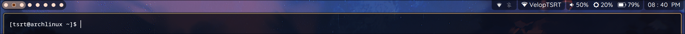

### My quickshell bar

I made this by emulating the appearance of my original waybar.

Currently I am coding this with the help of the not-so-detailed Quickshell docs, the QML docs and Mr. Gemini.

Funny how I'm learning QML before JavaScript.

### Example image:

